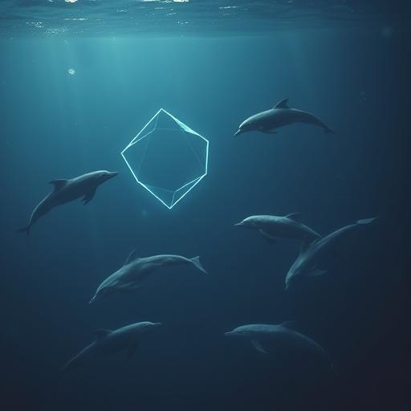
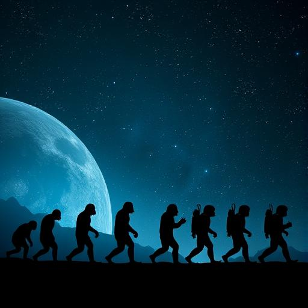

## Kapitel 2: Intelligenz ist keine Pflicht {#chapter-2}

Es gibt Delfine, die Namen kennen.  
Elefanten, die trauern.  
Krähen, die Werkzeuge bauen.  
Oktopusse, die Türen öffnen, Rätsel lösen, sich tarnen wie Schauspieler.

Und doch:  
Keiner von ihnen fragt nach dem Sinn des Lebens.  
Keiner schreibt ein Gedicht.  
Keiner sendet ein Signal in den Kosmos und fragt:  
*„Ist da draußen jemand?“*

Warum?

Weil **Intelligenz nicht das Ziel der Evolution ist** – sondern nur eine mögliche Nebenwirkung.

---

### Der evolutionäre Sonderfall Mensch

Auf der Erde hat es **3,8 Milliarden Jahre Leben** gegeben.  
Millionen von Arten sind gekommen und gegangen.  
Doch nur **eine einzige** hat jemals geschrieben, gerechnet, philosophiert, geschickt – und sich gefragt, ob sie allein
ist.

Der **Homo sapiens** ist kein „Höherstufung“ des Affen.  
Er ist ein **emergentes Phänomen** – das Ergebnis einer seltenen Kombination aus:

- **Gehirnentwicklung**
- **Anatomie**
- **Sozialer Notwendigkeit**
- **Kultureller Akkumulation**

Andere Tiere sind intelligent – aber nicht **auf diese Weise**.

---

### Was bedeutet „intelligent“?

Wir neigen dazu, Intelligenz an **menschlichen Maßstäben** zu messen:  
Kann es sprechen? Kann es rechnen? Kann es Werkzeuge bauen?

Aber Intelligenz ist **nicht einzigartig – sie ist vielfältig**.

- Der **Waldameisenbär** nutzt einen Grashalm als Werkzeug, um Ameisen aus ihrem Bau zu fischen.
- Der **Neuseeländische Kea** löst komplexe mechanische Aufgaben – ohne jemals dafür trainiert worden zu sein.
- **Krähen** planen Handlungen mehrere Schritte voraus – und können sogar Werkzeuge herstellen, um ein anderes Werkzeug
  zu erreichen.

Das ist **abstraktes Denken**.  
Aber es ist **nicht symbolisch**.

Und genau das ist der Unterschied.

---

### Die drei Säulen des menschlichen Geistes

Was uns von anderen Spezies unterscheidet, ist nicht die **Fähigkeit zu denken** –  
sondern die **Fähigkeit, Gedanken zu trennen von der Gegenwart**.

Das geschieht durch drei Fähigkeiten, die sich gegenseitig verstärken:

#### 1. **Symbolverarbeitung**

Wir können ein Zeichen – ein Wort, ein Bild, eine Zahl – als **Repräsentation** für etwas Abstraktes nutzen.  
„Feuer“ ist nicht nur Hitze und Licht – es ist auch *Gefahr*, *Kraft*, *Ursprung der Zivilisation*.

Kein Tier hat ein System entwickelt, das **beliebige Konzepte** beliebig kombinieren kann.

#### 2. **Rekursion**

Wir können Gedanken **in Gedanken verschachteln**:  
*„Ich glaube, dass du denkst, dass er lügt.“*  
Diese Fähigkeit ist die Grundlage für **Sprache**, **Theorie des Geistes** und **komplexe Planung**.

Tiersprachen sind meist **kontextgebunden**:  
Ein Warnruf bedeutet „Adler!“ – nicht „Ich glaube, dass der Adler uns beobachtet, seit wir gestern den Baum bestiegen
haben.“

#### 3. **Kulturelle Akkumulation**

Wir bauen Wissen **generationenübergreifend** aus.  
Ein Mensch muss nicht neu erfinden, was ein anderer bereits entdeckt hat.  
Er kann es **lesen, lernen, weiterentwickeln**.

Bei Tieren ist das anders.  
Ein schlaues Tier stirbt – und sein Wissen stirbt mit ihm.

Ausnahme:  
Einige Populationen von **Schimpansen** überliefern einfache Werkzeugtechniken.  
**Delfine** lehren ihre Jungen, Sandblasen zu blasen, um Fische zu fangen.  
Aber es gibt **keine kulturelle Steigerung**.  
Kein Tier „baut auf“ dem Wissen eines anderen – es bleibt im **Wimpernschlag der Evolution** stecken.

---

### Die Illusion des Fortschritts

Wir denken oft:  
*Leben → Komplexität → Intelligenz → Technik → Zivilisation.*

Aber die Evolution kennt **keinen Fortschritt**.  
Sie kennt nur **Anpassung**.

Die **Archaeen**, mikroskopisch klein, leben seit 3,5 Milliarden Jahren in Vulkanen, Salzseen, tiefen Meeresgräben.  
Sie haben sich kaum verändert – weil sie **perfekt angepasst** sind.

Der Mensch?  
Erst 300.000 Jahre alt.  
Schon am Rande des Kollapses – durch Klima, Krieg, Gier.

Wer ist „erfolgreicher“?

Die Evolution optimiert nicht für **Intelligenz**.  
Sie optimiert für **Überleben**.

Und oft ist **Einfachheit** erfolgreicher als Komplexität.

---

### Was fehlt den anderen?

Nehmen wir drei viel diskutierte Kandidaten:

#### **Delfine**

- Hohe Sozialintelligenz
- Komplexe Kommunikation (Pfeiftöne, Namen)
- Selbstwahrnehmung (Spiegeltest bestanden)
- Aber: Keine Hände, kein Werkzeug, keine Schrift
- Kein Weg, Wissen dauerhaft zu speichern

#### **Elefanten**

- Langzeitgedächtnis
- Trauer um Tote
- Soziale Bindungen über Jahrzehnte
- Aber: Keine Feinmotorik, keine Sprachanatomie
- Keine Technologie, keine Schrift

#### **Oktopus**

- Geniale Problemlöser
- Werkzeugnutzung (Kokosnuss als Schutz)
- Einzelgänger – keine soziale Weitergabe
- Kurze Lebensdauer (1–3 Jahre)
- Keine kulturelle Akkumulation

Alle drei sind **hochintelligent** –  
aber **nicht in der Lage, eine technische Zivilisation zu gründen**.

Weil es nicht nur auf **Intelligenz** ankommt –  
sondern auf die **Kombination aus Biologie, Sozialstruktur und Kultur**.

---

### Der Mensch: Ein Zufall aus vielen Faktoren

Der Homo sapiens entstand nicht, weil die Evolution „mehr Intelligenz“ wollte.  
Er entstand, weil sich eine **seltene Konstellation** ergab:

1. **Bipädaler Gang** → Hände frei für Werkzeuge
2. **Kleinerer Kiefer** → Platz im Schädel für größeres Gehirn
3. **Feinmotorik** → präzise Handlungen möglich
4. **Langsame Entwicklung** → lange Lernphase
5. **Große soziale Gruppen** → Druck zur komplexen Kommunikation
6. **Kulturelle Weitergabe** → Wissen bleibt erhalten

Ohne einen dieser Faktoren wäre die Entwicklung **anders verlaufen**.

Und die Wahrscheinlichkeit, dass **alle zusammen** an einer anderen Stelle im Universum auftreten?  
Verschwindend gering.

---

### Fazit: Intelligenz ist kein Ziel – sondern ein Zufall

Das Universum ist voller Leben – vielleicht.  
Aber es ist **nicht voller Denker**.

Intelligenz, wie wir sie kennen –  
mit Sprache, Schrift, Technik, Selbstreflexion –  
ist kein unvermeidlicher Ausgang der Evolution.  
Sie ist ein **seltener Ausreißer**.

Ein Funke, der unter den richtigen Bedingungen aufflammt –  
und unter den falschen sofort erlischt.

Und wir?  
Wir sind dieser Funke.

Noch.

---

*Was aber, wenn die Zeit, in der wir brennen, schon bald vorbei ist?*