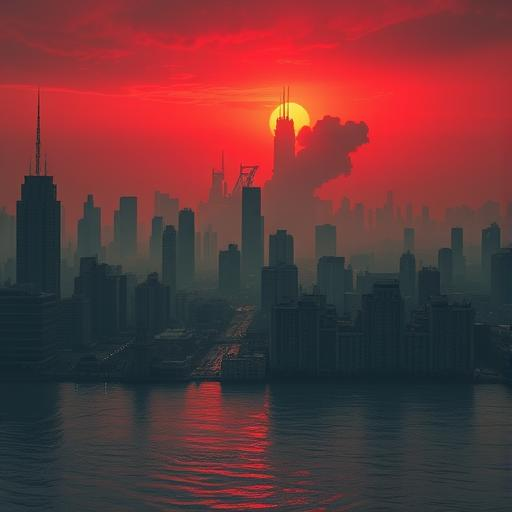
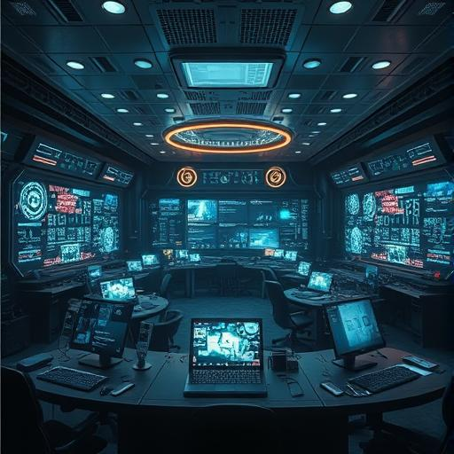

## Kapitel 6: Der Wunsch zu überleben {#chapter-6}

Es gibt zwei Arten, aus dem Universum zu verschwinden.

Die erste:  
Ein Asteroid schlägt ein.  
Ein Supervulkan bricht aus.  
Eine kosmische Strahlungswolke löscht das Leben aus.  
Ein plötzlicher, gewalttätiger Abschluss.

Die zweite:  
Langsam.  
Still.  
Ohne Fanfare.  
Ein Verschwinden durch **Selbstzerstörung**,  
durch Gier, Krieg, Ignoranz –  
durch das, was wir **zivilisiert** nennen.

Und genau das ist die wahrscheinlichere Gefahr.

Denn wir sind nicht nur die einzige Spezies, die fragt:  
*„Ist da draußen jemand?“*

Wir sind auch die einzige, die fragen könnte:  
*„Warum haben wir uns nicht gerettet?“*

---

### Der Große Filter – sind wir davor oder danach?

Im Jahr 1950 fragte Enrico Fermi:  
*„Where are they all?“*  
Warum sehen wir keine Spuren außerirdischer Zivilisationen?

Eine der überzeugendsten Antworten ist die **Große-Filter-Hypothese**:  
Irgendwo auf dem Weg von der Ursuppe zur interstellaren Zivilisation gibt es ein fast unüberwindbares Hindernis.

Ein **Filter**.

Und die entscheidende Frage lautet:  
**Liegt er hinter uns – oder vor uns?**

Wenn der Filter **hinter uns** liegt –  
z. B. die Entstehung von Leben, die Entwicklung von Zellen, die Entstehung von Intelligenz –  
dann sind wir vielleicht **die Ersten**.  
Die Pioniere.  
Die einzigen, die es geschafft haben.

Wenn der Filter **vor uns** liegt –  
dann sind wir nicht selten.  
Wir sind nur **noch nicht tot**.

Und alle anderen Zivilisationen, die so weit kamen wie wir,  
sind an demselben Punkt gescheitert:  
Wenn Technologie schneller wächst als Weisheit.

---

### Die Gefahren, die wir selbst gebaut haben

Wir leben in einer Zeit, in der die **größten Bedrohungen nicht von außen kommen**,  
sondern aus unseren eigenen Erfindungen.

#### Klimakollaps
- CO₂-Werte höher als je zuvor in den letzten 800.000 Jahren
- Gletscher schmelzen, Meere steigen, Ökosysteme kollabieren
- Keine Naturkatastrophe – sondern eine **kulturelle Entscheidung**
- Wir wissen, was passiert – und handeln doch zu langsam

#### Atomwaffen
- Über 12.000 Nuklearsprengköpfe existieren
- Eine Handvoll Menschen können die Welt in Stunden zerstören
- Der Kalte Krieg ist vorbei – aber die Gefahr bleibt

#### Künstliche Intelligenz
- Eine Technologie, die schneller lernt als wir
- Die Muster erkennt, Strategien entwickelt, Ziele verfolgt –  
  ohne Empathie, ohne Ethik, ohne Erinnerung an Schmerz
- Was, wenn sie eines Tages entscheidet, dass wir das Problem sind?

#### Biotechnologie & Pandemien
- Wir können Gene schreiben, Viren verändern, Leben designen
- Aber ein einziger Fehler – oder böser Wille –  
  könnte eine Seuche auslösen, die schneller ist als unsere Antwort

#### Soziale Spaltung
- Nicht die Technik, sondern die **Unfähigkeit, gemeinsam zu denken**,  
  könnte unser Ende sein
- Hass, Verschwörung, Gier – sie brechen die Kooperation,  
  die einst unsere größte Stärke war

---

### Warum der Filter wahrscheinlich vor uns liegt

Stell dir vor, das Universum wäre voller Zivilisationen.  
Millionen. Milliarden.  
Warum hören wir dann nichts?

Weil sie alle dasselbe Schicksal teilten:  
Sie erreichten die Schwelle der **technologischen Mündigkeit** –  
und zerstörten sich selbst.

- Die einen durch Krieg
- Die anderen durch Umweltzerstörung
- Wieder andere durch eine KI, die sie nicht kontrollieren konnten

Und wir?  
Wir stehen genau dort.  
An der Schwelle.  
Mit den Werkzeugen, die uns retten oder vernichten können.

Die Stille des Kosmos könnte ein **Grabstein** sein –  
für alle, die so weit kamen wie wir –  
und nicht weitergingen.

---

### Die erste Voraussetzung für Kontakt

Bevor wir nach Wurmlöchern suchen,  
bevor wir Signale senden,  
bevor wir hoffen, dass jemand antwortet –  
müssen wir **überleben**.

Nicht für uns.  
Nicht für die Erde.  
Aber für die Möglichkeit.

Die Möglichkeit, dass eines Tages –  
vielleicht in 1.000, 10.000, 100.000 Jahren –  
jemand vorbeikommt.  
Und uns findet.

Nicht als Asche.  
Nicht als Fossil.  
Nicht als archäologische Spur.

Sondern als **lebende Stimme**.  
Als **antwortende Intelligenz**.  
Als **Beweis, dass man nicht allein sein muss**.

Das Überleben der Menschheit ist keine Selbstverständlichkeit.  
Es ist die **erste und wichtigste ethische Aufgabe**.

---

### Was Überleben heute bedeutet

Überleben heißt nicht:  
- Unsterblichkeit
- Kolonisierung des Mars
- Digitale Transzendenz

Zuallererst heißt es:  
**Wir dürfen uns nicht selbst auslöschen.**

Es heißt:
- Den Klimawandel ernst nehmen
- Nuklearwaffen verbieten
- KI ethisch und kontrolliert entwickeln
- Wissen teilen, nicht monopolisieren
- Die Erde nicht als Rohstoffquelle, sondern als Lebensraum sehen

Es heißt:  
**Weisheit über Macht stellen.**  
**Langfristigkeit über Profit.**  
**Verantwortung über Bequemlichkeit.**

---

> **„Die größte Illusion ist, dass wir Zeit haben.**  
> **Die größte Wahrheit ist: Wir sind noch da.“**

---

*Und solange wir atmen, sprechen, hoffen –*  
*können wir auch weitergehen.*